# 🛡️ Awesome Secret Scanning Platform Ecosystem

  

  
  
  
  
  
  

> 🔐 **Curated List of Enterprise SaaS Platforms & Open-Source Tools for Secret Scanning, API Key Leak Detection, Credential Security, and DevSecOps Automation.**

**Last updated: September 2026**

---

## 📌 Table of Contents
- [🔍 Overview & Industry Trends](#-overview--industry-trends)
- [🏢 SaaS / Hosted Platforms](#-saas--hosted-platforms)
- [⚡ Open-Source GitHub Projects](#-open-source-github-projects)
- [🛠️ Best Practices & Frameworks](#️-best-practices--frameworks)
- [🤝 How to Contribute](#-how-to-contribute)
- [⚠️ Disclaimer](#️-disclaimer)
- [📈 Star History](#-star-history)

---

## 🔍 Overview & Industry Trends

This repository tracks notable **SaaS platforms** and **open-source security projects** dedicated to **Secret Scanning**. These platforms detect hardcoded API keys, OAuth tokens, database credentials, SSH keys, private certificates, and secrets across source code repositories, git history, CI/CD pipelines, container images, and collaboration channels before malicious actors exploit them.

### 🌟 Key Sector Highlights
* **Industry Standards**: Tools like **TruffleHog**, **Gitleaks**, and **GitGuardian** lead the secret detection domain, powering automated security checks in modern DevSecOps pipelines.
* **Shift-Left Security**: Secret scanning runs directly in developer pre-commit hooks, pull request checks, and automated continuous integration pipelines.
* **Active Verification**: Enterprise tools actively verify detected credentials against provider APIs to differentiate live, actionable leaks from stale test secrets.

---

## 🏢 SaaS / Hosted Platforms

> 💡 **Market Size & Industry Dynamics**: The global Secret Scanning and Application Security Posture Management (ASPM) market is estimated at **$1.8B – $3.2B**, growing at a **~22% CAGR**. The sector is **moderately fragmented**, balancing major cloud platform providers (GitHub, GitLab) with specialized enterprise security vendors (GitGuardian, Cycode, SpectralOps) competing for organization-wide security governance.

| 🏢 Platform / Product | 📝 Description | 💵 Starting Pricing | 🎁 Free Tier / Trial Limit | 📊 Company Scale (Valuation / Revenue) |
| :--- | :--- | :--- | :--- | :--- |
| **[GitHub Secret Scanning](https://docs.github.com/en/code-security/secret-scanning)** | Native secret scanning and push protection available through GitHub Advanced Security, with partner validity checks for many secret types. | $19/active committer/month (Secret Protection for private repos) | Free forever for all public repositories on GitHub.com; 30-day free trial for private repos | **$3.1T+** Market Cap (Microsoft) / **$1.5B+** GitHub ARR |
| **[SpectralOps (Check Point)](https://spectralops.io/)** | Secrets and misconfiguration scanning platform delivered as part of broader cloud and code security suites. | Starts at ~$10,000/year ($1,000/month baseline enterprise tier) | 30-day free trial via Check Point Infinity Portal with full scanner access | **$20B+** Market Cap (Check Point) / **$2.5B** ARR |
| **[GitLab Secret Detection](https://docs.gitlab.com/ee/user/application_security/secret_detection/)** | Built-in secret detection capabilities in GitLab that scan repositories and pipelines for leaked credentials. | $0/user/month (Free plan) / $29/user/month (GitLab Premium) | Free forever on GitLab Free tier (includes 400 CI/CD compute minutes/month); 30-day free trial for Ultimate | **$8.5B+** Market Cap / **$650M+** ARR |
| **[Checkmarx Secrets](https://checkmarx.com/)** | Secrets detection module within broader Checkmarx One ASPM / code-security platform focused on enterprise governance and risk prioritization. | Starts at ~$30,000/year enterprise contract baseline minimum | 30-day free trial / Proof of Concept (PoC) upon request & free limited VS Code extension | **$1.15B+** Valuation / **$150M+** ARR |
| **[GitGuardian](https://www.gitguardian.com/)** | Leading enterprise secrets detection platform with broad coverage across code, CI/CD, collaboration tools, and public monitoring, plus remediation workflows and honeytokens. | $5,500/year (Business plan starting price for 25 developer block, ~$18.33/dev/month) | Free forever for up to 25 contributing developers (10,000 API calls/mo); 30-day free trial for Business features | **$150M+** Valuation / **$44M+** Total Funding |
| **[Cycode](https://cycode.com/)** | Application security platform that includes secrets detection alongside broader pipeline and code security capabilities. | $360/monitored developer/year ($30/dev/month starting tier baseline) | 14-day free trial (upon request/POC) + free standalone Cygives / Source Code Leakage tools | **$100M+** Valuation / **$80M+** Total Funding |
| **[Legit Security](https://www.legitsecurity.com/)** | Enterprise application security posture management (ASPM) and secrets detection platform covering code, pipelines, and developer workflows. | Starts at ~$15,000/year enterprise contract baseline (~$120–$150/dev/year) | 14-day free trial for Secrets Detection & VibeGuard (upon request) | **$100M+** Valuation / **$40M+** Total Funding |
| **[Doppler Secret Scanner](https://www.doppler.com/)** | Secrets management platform providing continuous scanning and detection features to prevent secrets from landing in code. | $21/user/month (Team Plan) / $7/user/month (annual rate) | Free forever for up to 3 users (Developer Plan with CLI & 10 projects limit) | **$100M+** Valuation / **$30M+** Total Funding |
| **[TruffleHog (Truffle Security)](https://trufflesecurity.com/)** | Commercial platform and support built around the popular open-source TruffleHog engine, adding enterprise features, scale, and workflow integrations. | Free OSS engine; Enterprise tier starts at ~$10,000/year base contract | Free forever for Open-Source CLI engine (unlimited local/repo scans); 14-day free trial for Enterprise features | **$50M+** Valuation / **$14M+** Total Funding |

---

## ⚡ Open-Source GitHub Projects

> 🔓 **Sorted by GitHub_Stars (Descending)**. Open-source scanners provide the core detection foundation across modern CI/CD pipelines.

- **[Trivy](https://github.com/aquasecurity/trivy)**   
  Comprehensive open-source security scanner by Aqua Security featuring secret detection modules alongside container and IaC vulnerability scanning.

- **[Gitleaks](https://github.com/gitleaks/gitleaks)**   
  Fast, lightweight, MIT-licensed secret scanner optimized for git repositories, pre-commit hooks, and CI/CD pipelines with customizable TOML rules.

- **[TruffleHog](https://github.com/trufflesecurity/trufflehog)**   
  Leading open-source secret scanner detecting credentials via high-entropy analysis and regex, verifying findings with live API checks against 800+ providers.

- **[Semgrep](https://github.com/semgrep/semgrep)**   
  Fast polyglot static analysis engine supporting custom semantic secret patterns, AST parsing, and secret detection rules across 30+ programming languages.

- **[git-secrets](https://github.com/awslabs/git-secrets)**   
  Classic open-source scanner from AWS Labs designed to prevent committing passwords, AWS access keys, and private credentials into git history.

- **[Checkov](https://github.com/bridgecrewio/checkov)**   
  Static code analysis tool for Infrastructure as Code (IaC) with built-in detection for hardcoded secrets in Terraform, CloudFormation, and Kubernetes.

- **[detect-secrets](https://github.com/Yelp/detect-secrets)**   
  Baseline-oriented secret scanner by Yelp—ideal for large legacy codebases where existing findings are baselined and only new secrets are flagged.

- **[ggshield](https://github.com/GitGuardian/ggshield)**   
  GitGuardian's open-source CLI engine for scanning local git repositories, developer pre-commit hooks, and CI/CD pipelines for 400+ secret types.

- **[git-hound](https://github.com/tillson/git-hound)**   
  Batch secret sniffer for GitHub repository discovery using pattern matching, regex, and sensitive key detection for security researchers.

- **[Secretlint](https://github.com/secretlint/secretlint)**   
  Pluggable secret linting tool that prevents credentials, API tokens, and private keys from landing in git commits and npm packages.

- **[Tartufo](https://github.com/godaddy/tartufo)**   
  GoDaddy's Python-based secret scanner searching git repositories for high-entropy strings and secret signatures without requiring a full git clone.

- **[Whispers](https://github.com/skyscanner/whispers)**   
  Static code analysis tool by Skyscanner designed to parse structured text files (YAML, JSON, XML, Dockerfiles) and detect hardcoded secrets.

- **[git-secret-scanner](https://github.com/padok-team/git-secret-scanner)**   
  Community orchestrator tool running multiple open-source engines (Gitleaks, TruffleHog) concurrently to maximize secret detection coverage.

---

## 🛠️ Best Practices & Frameworks

### 🎯 Recommended Setup Strategy
1. **Developer Workflows**: Implement **Gitleaks** or **ggshield** in pre-commit hooks for instant local secret blocking.
2. **CI/CD Pipeline Security**: Execute **TruffleHog** or **Trivy** during pull request validation to prevent unverified credentials from merging.
3. **Enterprise Governance**: Layer commercial platforms (**GitGuardian**, **GitHub Advanced Security**, **Cycode**) for organization-wide compliance, historical scanning, and automated credential revocation workflows.

---

## 🤝 How to Contribute

1. Fork the repository.
2. Add/edit entries in `README.md` following the tabular or open-source list format.
3. Submit a Pull Request with a clear summary of your additions.

Check out [Awesome-Awesome-Awesome](https://github.com/ishandutta2007/Awesome-Awesome-Awesome) for more curated lists!

---

## ⚠️ Disclaimer

- This list is community-curated for informational purposes.
- Secret scanning is part of a broader defense-in-depth strategy. Detected secrets must be rotated immediately.

---

## 📈 Star History

---

  <b>Made with ❤️ for Security Engineers, DevSecOps Teams, and Developers.</b>

